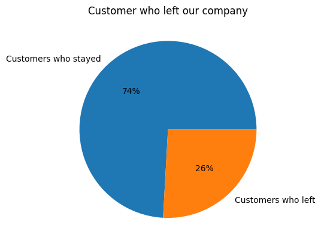
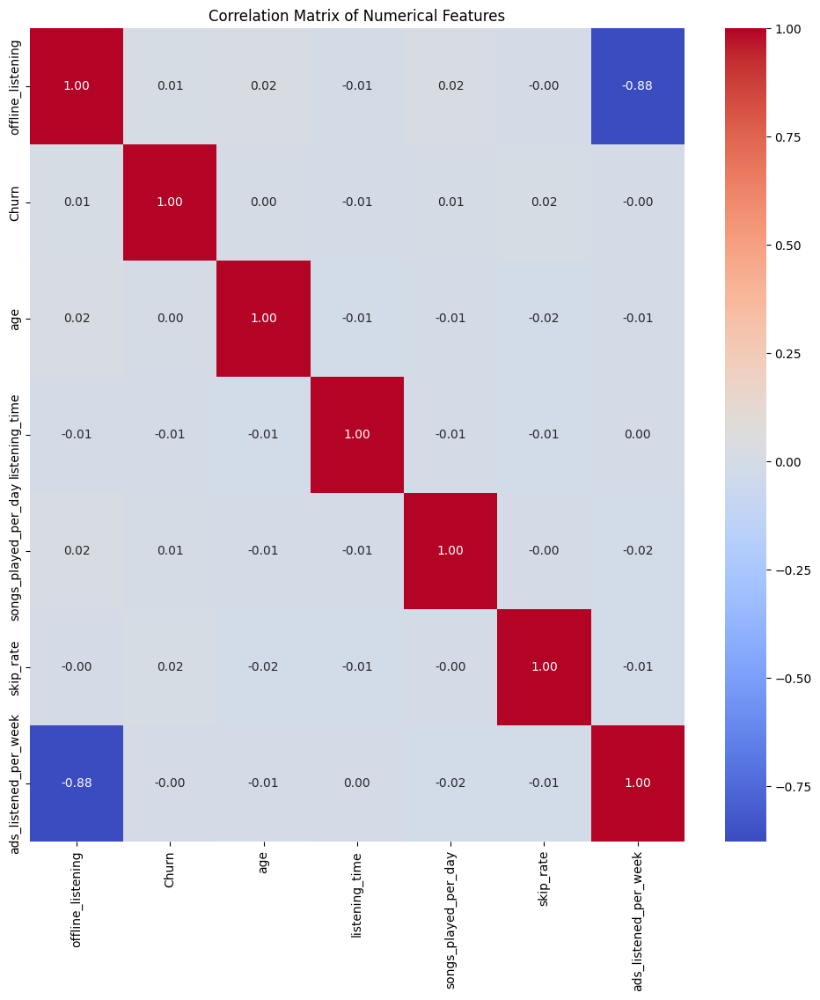

# 🎵 Spotify Customer Churn Analysis & Prediction

## 📌 Project Overview
This project focuses on analyzing user behavior data from a Spotify-like dataset to understand **customer churn** and build a **machine learning model** capable of predicting whether a user is likely to churn. The goal is to uncover key behavioral patterns that influence churn and support data-driven retention strategies.

## 🎯 Objectives
- Perform exploratory data analysis (EDA) to understand user behavior
- Identify factors contributing to customer churn
- Preprocess and clean the dataset for modeling
- Build and evaluate machine learning models to predict churn
- Generate insights that can help improve customer retention

## 🗂️ Dataset
- **Source:** Spotify churn dataset (CSV format)
- **Description:** The dataset contains user activity, subscription behavior, and engagement metrics used to determine churn likelihood.
- **Target Variable:** `churn` (binary classification)

## 🛠️ Tools & Technologies
- **Programming Language:** Python  
- **Libraries:**  
  - Pandas, NumPy – data manipulation  
  - Matplotlib, Seaborn – data visualization  
  - Scikit-learn – machine learning & evaluation  
- **Environment:** Jupyter Notebook / VS Code

## 🔍 Methodology

### 1. Data Exploration & Cleaning
- Inspected data structure and summary statistics
- Handled missing values and data inconsistencies
- Performed feature understanding and transformations

### 2. Exploratory Data Analysis (EDA)
- Analyzed distributions of user activity and subscription features
- Visualized churn vs non-churn behavior
- Identified trends and correlations affecting churn

### 3. Feature Engineering
- Selected relevant numerical and categorical features
- Encoded variables as required for modeling
- Scaled features where necessary

### 4. Machine Learning Modeling
- Split data into training and testing sets
- Trained classification models to predict churn
- Evaluated performance using accuracy and other metrics

## 📊 Visualizations & Insights

### Churn Distribution

This chart highlights the proportion of churned versus retained users, clearly illustrating the business impact of customer churn.

### Feature Correlation Analysis

The correlation heatmap reveals key relationships between numerical features and churn, guiding feature selection for predictive modeling.


## 📊 Key Insights
- User engagement metrics strongly influence churn probability
- Lower activity levels are associated with higher churn risk
- Machine learning models can effectively identify at-risk users
- Predictive analytics can help guide targeted retention strategies

## 📈 Results
- Successfully built a churn prediction model
- Achieved reliable performance on unseen test data
- Produced actionable insights for customer retention decisions

## 🚀 How to Run This Project
1. Clone the repository:
   ```bash
   git clone https://github.com/https://github.com/Joyerics/spotify-customer-analysis.git
2. Navigate to the project directory

3. Install required libraries:
 pip install pandas numpy matplotlib seaborn scikit-learn
4. Open the notebook:
 jupyter notebook
5. Run all cells sequentially

📌 Future Improvements

* Test additional machine learning models

* Perform hyperparameter tuning

* Incorporate deep learning approaches

* Deploy the model as a web application or dashboard

👤 Author

Chinenye Joy Onyedika
Data Analyst | Machine Learning Enthusiast
📍 Windsor, Ontario, Canada
🔗 LinkedIn | GitHub